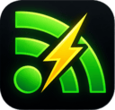

# 🎬 PSA Fetch - Movie & TV Search Engine

<p align="center">
  
</p>

<p align="center">
  <strong>Next-gen movie & television discovery web application powered by real-time metadata, live highest-rated releases, season/episode guides, and instant PSA HEVC torrent download integrations.</strong>
</p>

---

## ✨ Features

- 🔍 **Instant Live Search**: Search across millions of movies, TV shows, and series with debounced autocomplete and multi-source API fallback (OMDb & TVMaze).
- 🔥 **Dynamic Highest-Rated Releases**: Real-time homepage showcasing current year's highest IMDb-rated movies and series with live Metahub posters.
- 🎯 **Filter Tabs**: Instantly toggle between **All**, **Movies**, and **Series** on both the homepage and live search results.
- 🎲 **Random Title Picker**: One-click dice action in the navigation bar to discover unexpected cinema gems.
- 📺 **Comprehensive TV Season & Episode Guide**: Interactive season selector tabs with episode lists, ratings, air dates, and individual episode show modal details.
- ⚡ **PSA HEVC Downloads Section**:
  - Automatically queries BT4G RSS feeds for official **HEVC-PSA** encode releases.
  - Supports both **Movies** and **TV Episodes** (e.g. `S01E01`).
  - Strict filtering to exclude malicious executables (`.exe`), software (`Application`), and title collisions.
  - Formats separated into **4K UHD (2160p)**, **1080p**, and **720p** badges with file sizes, audio channels (DDP5.1, 8CH), and **Download Magnet** / **Copy Magnet** buttons.
- 🔖 **Watchlist**: Save movies and series to your personal local storage watchlist.
- 💎 **Green Liquid Glass Aesthetic**: Custom glassmorphism UI built with **Tailwind CSS v4** and **Material UI v6**, featuring fluid ambient background orbs, smooth hover effects, and responsive mobile-first design.

---

## 🛠️ Technology Stack

- **Framework**: [React 19](https://react.dev/) + [TypeScript](https://www.typescriptlang.org/)
- **Bundler & Dev Server**: [Vite 6](https://vite.dev/)
- **Styling**: [Tailwind CSS v4](https://tailwindcss.com/) + [Material UI v6 (MUI)](https://mui.com/)
- **Icons**: [MUI Icons](https://mui.com/material-ui/material-icons/)
- **APIs & Sources**:
  - OMDb API (Rotated API keys)
  - TVMaze API (Public Show & Episode fallback)
  - Cinemeta Open Catalog (Top & Genre feeds)
  - Metahub CDN (High-resolution movie artwork)
  - BT4G RSS Feed (PSA HEVC torrent downloads)

---

## 🚀 Getting Started

### Prerequisites

- [Node.js](https://nodejs.org/) (version 18+ recommended)
- [npm](https://www.npmjs.com/) or [yarn](https://yarnpkg.com/) / [pnpm](https://pnpm.io/)

### Installation

1. Clone the repository:

   ```bash
   git clone https://github.com/ziard47/PSAFetchWeb.git
   cd PSAFetchWeb
   ```

2. Install dependencies:

   ```bash
   npm install
   ```

3. Start the development server:

   ```bash
   npm run dev
   ```

4. Open your browser and navigate to:
   ```
   http://localhost:5173/
   ```

---

## 📦 Available Scripts

- `npm run dev` - Starts the Vite development server with local proxy for BT4G RSS feeds.
- `npm run build` - Type-checks with `tsc` and creates an optimized production bundle in `dist/`.
- `npm run preview` - Locally previews the production build.

---

## 🌐 Vite Proxy Configuration

The development server uses Vite proxying in `vite.config.ts` to seamlessly forward RSS requests to `bt4gprx.com` without CORS obstacles:

```ts
export default defineConfig({
  server: {
    proxy: {
      "/api/bt4g": {
        target: "https://bt4gprx.com",
        changeOrigin: true,
        rewrite: (path) => path.replace(/^\/api\/bt4g/, ""),
        headers: {
          "User-Agent": "Mozilla/5.0 ...",
        },
      },
    },
  },
});
```

---

## 📄 License

This project is created for educational and personal discovery purposes.
